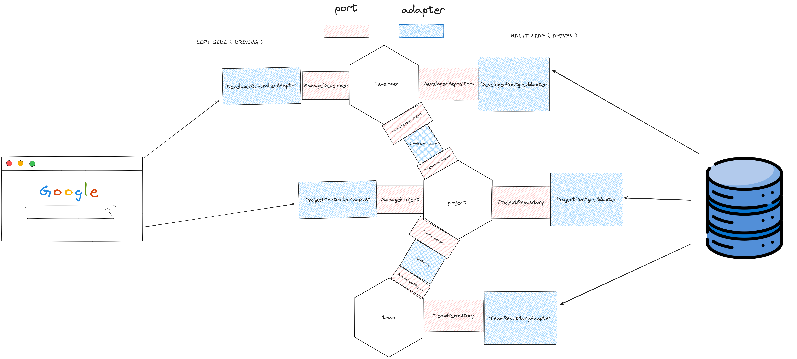

# DevManager

[](https://github.com/Jayllyz/DevManager/actions/workflows/maven.yml)
[](https://github.com/Jayllyz/DevManager/actions/workflows/mega-linter.yml)

This is a simple project to manage projects and developers in Java with a Javalin API and PostgreSQL database.

## Usage

Copy the `.env.example` file to `.env` and fill in the environment variables.

```sh
cp .env.example .env
```

Start docker-compose to run the PostgreSQL database.

```sh
docker compose up -d
```

Run the application.

```sh
mvn clean compile exec:java
```

## Architecture


